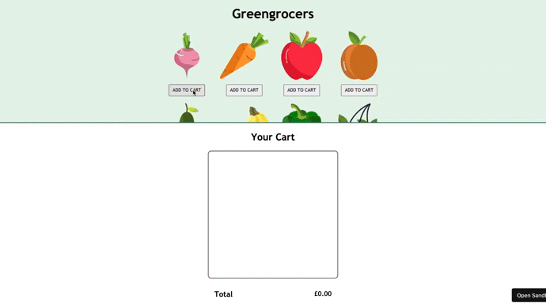

# React Greengrocers

You're going to recreate the [javascript greengrocers exercise](./images/greengrocer-exercise.gif) from scratch. But this time, using React!

Reusing an exercise that you already know will help you understand the fundamentals of React.

## Setup

1. Fork this repository
2. Clone the forked repository onto your local machines
3. In the root directory, type `npm install`, which installs dependencies for the project
4. Finally, type `npm run start`, which starts a development server that runs your website in the browser. That server will reload your website whenever you make any changes to source files

## Deliverables

- A user can view a selection of items in the store
- From the store, a user can add an item to their cart
- From the cart, a user can view and adjust the number of items in their cart
    - If an item's quantity equals zero it is removed from the cart
- A user can view the current total in their cart

## Instructions

- Create all the components you need, using the templates as a reference
- Create all the pieces of the state you need, using the example provided
- Add all the event listeners you need to make the page reactive

## Tips

- Try to figure out what your component hierarchy should be before starting to code
- You should aim to keep your state closest to the components that use it. Avoid whenever you can passing down pieces of state

## Extension 1

- Add filters to the store ie. filter by item type; when a user clicks a filter they will only see items of that type
- Add sorting to the store ie. sort by price or sort alphabetically; when a user clicks sort they will see a sorted list of items

## Extension 2

- Add a new detail component for each of the items, and render it conditionally after clicking on an item
